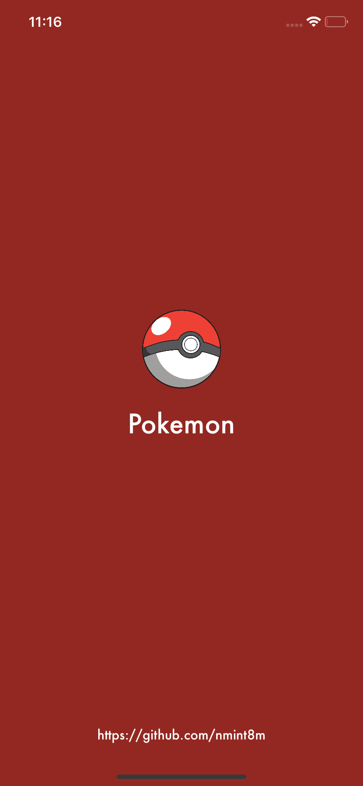
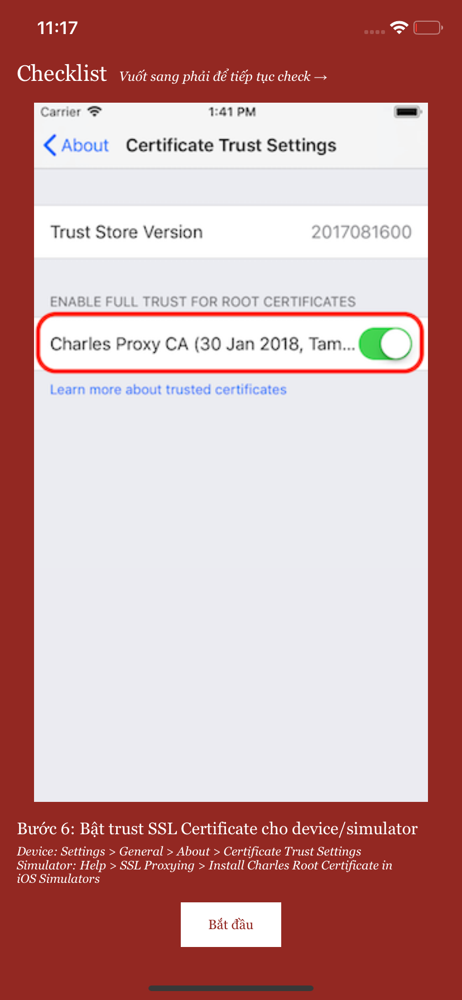
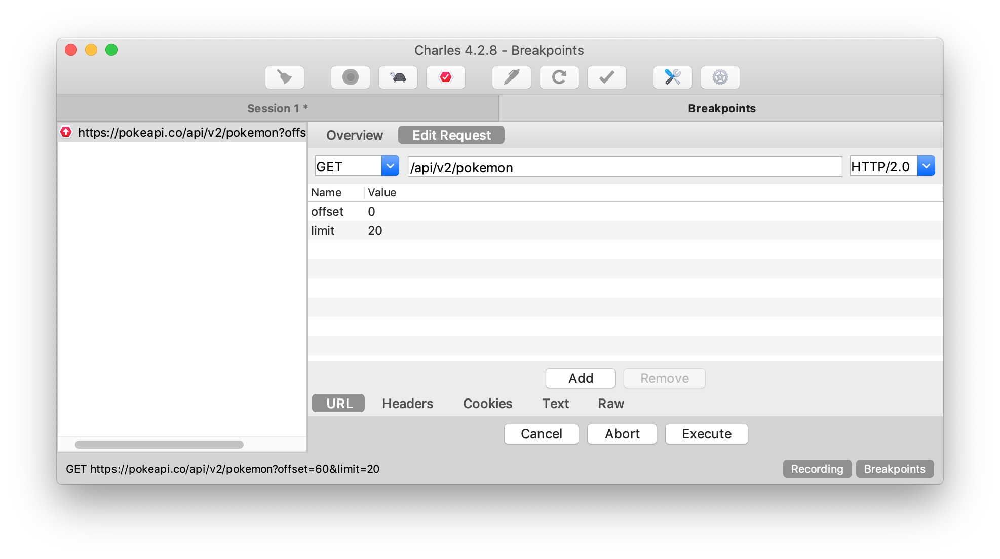
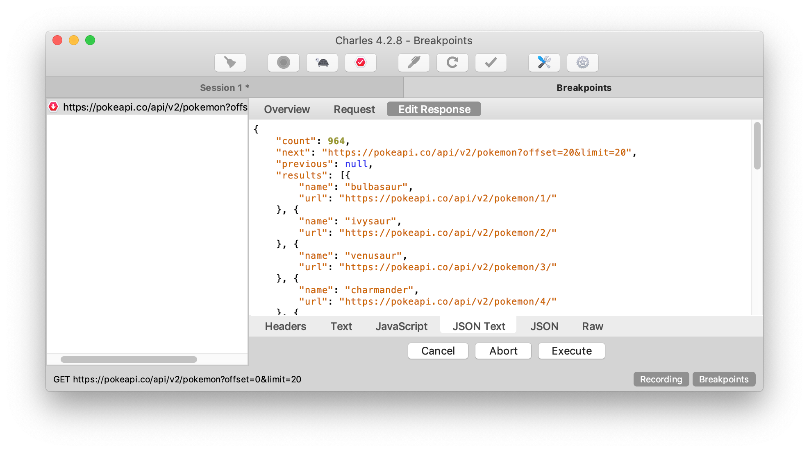
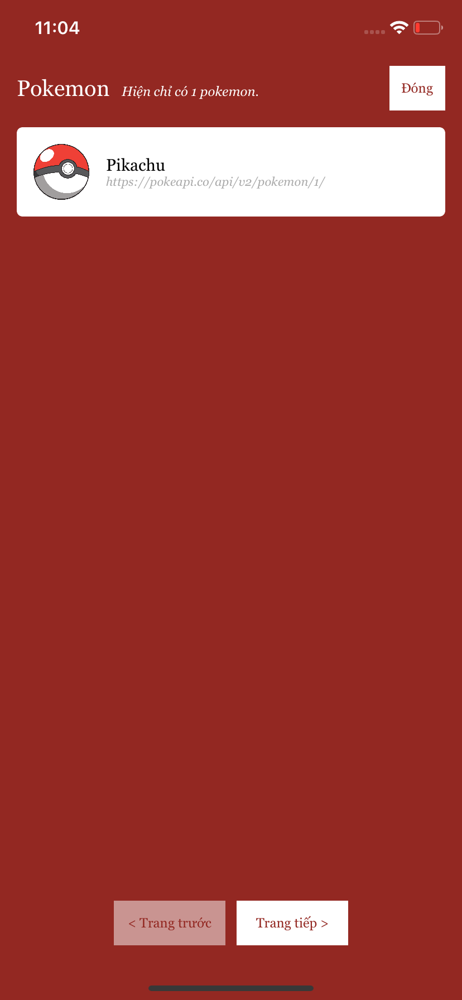
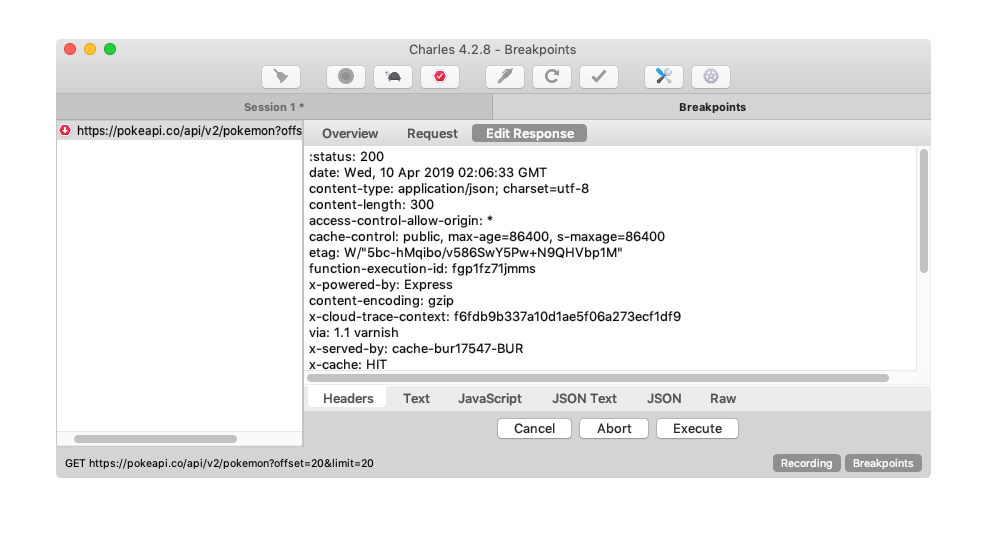
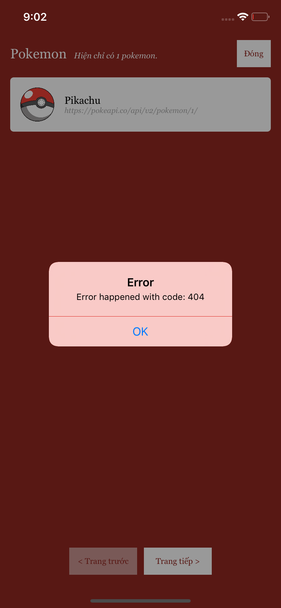

#  Charles Guide - Example

_Written by **Nguyen Minh Tam**_

Ở phần trước mình đã trình bày cách cài đặt môi trường và cách làm việc cùng Charles. Trong phần này mình sẽ demo sử dụng Charles debug app nhỏ sử dụng API Pokemon [https://pokeapi.co](https://pokeapi.co). Bắt đầu thôi nào! 📱

### Cài đặt project example

Mở Terminal, đến folder `CharlesGuide` (bằng cách kéo thả vào Terminal), chạy lần lượt:

```
bundle install
```

```
bundle exec pod install
```

Mở Charles và làm các bước sau:

- Cài đặt focus vào host: `pokeapi.co`
- Cài đặt recording setting cho host: `pokeapi.co`
- Cài đặt breakpoint setting cho path: `api/v2/pokemon` và tick chọn cả `Request` và `Response`

> **My note:**
> 
> Như mình đã đề cập ở phần trước, nên cài đặt focus và recording setting trỏ tới host, còn breakpoint setting chỉ cần quy định path là được.

Sau khi cài đặt, mở file `CharlesGuide.xcworkspace` và run project.

|  |  |
|---|---|
| Màn hình khởi động | Nhấn Bỏ qua / Bắt đầu |

Lúc này giao diện của Charles như sau:

<center>
	
</center>

Như bạn đã thấy, chúng ta có thể sửa request infor (như url, header,...) khi chọn tab `Edit request`. Nhưng lúc này ta sẽ tạm bỏ qua. Tiếp tục chọn `Execute`.

Khi response trả về, giao diện của Charles sẽ như sau:

<center>
	
</center>

Vào tab `JSON Text` trong `Edit response`, copy dán đoạn JSON phía dưới vào và chọn `Execute`.

```
{
	"count": 1,
	"next": "https://pokeapi.co/api/v2/pokemon?offset=20&limit=20",
	"previous": null,
	"results": [{
		"name": "Pikachu",
		"url": "https://pokeapi.co/api/v2/pokemon/1/"
	}]
}
```

Kết quả trên simulator/device sẽ hiển thị như sau:

<center>
	
</center>

Như vậy, bạn đã biết cách sửa JSON của response, tiếp theo chúng ta sẽ đi tới sửa Headers của response. Bấm `Trang tiếp >`, làm như các bước trên và đợi response trả về. Bật tab `Header` tonse `Edit response`, bạn sẽ thấy như sau:

<center>
	
</center>

Sửa `:status: 200` thành và chọn `Execute`. 

```
:status: 404
```

Kết quả trên simulator/device sẽ hiển thị như sau:

<center>
	
</center>

Sau khi nhấn `OK` để tắt pop up thì mình sẽ gọi lại API một lần nữa.

Sau ví dụ đơn giản trên, mình muốn đề cập các vấn đề thường gặp khi bạn không debug được với Charles. Các lý do như sau:

- Liên quan tới config lúc đầu. Đọc lại [Hướng dẫn cài đặt Charles](./CharlesGuide-Install.md) 🔧
- Cài đặt sai host cho `Focus Host` và `Recording Settings`
- Cài đặt sai path cho `Breakpoint Setting`.
- Chưa cài đặt SSL Proxying Certificates. Đọc lại [Hướng dẫn cài đặt Charles](./CharlesGuide-Install.md) 🔧
- App của bạn đang cache data response. Cụ thể như demo app đang sử dụng thư viện `Alamofire`, nó sẽ cache lại response, bởi vậy ở `AppDelegate` mình đã cài đặt không cho nó cache nữa:

```swift
    // AppDelegate.swift
    func application(_ application: UIApplication, didFinishLaunchingWithOptions launchOptions: [UIApplication.LaunchOptionsKey: Any]?) -> Bool {
        // Config not cache data
        URLCache.shared = URLCache(memoryCapacity: 0, diskCapacity: 0, diskPath: nil)
        ...
    }
```

Cám ơn các bạn đã đọc hết tài liệu **Charles Guide**. Ủng hộ mình tiếp tục viết blog bằng cách bấm ⭐️ cho mình nhé!

### Reference

Đọc lại [Hướng dẫn cài đặt Charles](./CharlesGuide-Install.md) 🔧

Đọc lại [Hướng dẫn sử dụng Charles](./CharlesGuide-Usage.md) 🗒

Quay lại [Charles Guide](https://github.com/nmint8m/charlesguide)  