#  Charles Guide - Usage

_Written by **Nguyen Minh Tam**_

Ở phần trước mình đã trình bày cách cài đặt môi trường để làm việc cùng Charles. Trong phần này mình sẽ đề cập đến giao diện, những chức năng cơ bản và thường được sử dụng nhất của nó. Let's check it out! 🥇

## Mục lục

- [Work with Charles Proxy](#work-with-charles-proxy)
	- [Application Interface](#application-interface)
	- [Focus](#focus)
	- [Recording settings](#recording-settings)
	- [Breakpoint](#breakpoint)
	- [Handling breakpoint](#handling-breakpoint)
	- [Throttle settings](#throttle-settings)

## Work with Charles Proxy

### Application Interface

	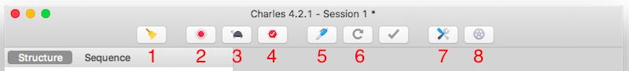

Các nút thông dụng: 

1. **Clear the current session**: 
   - Session chứa tất cả các thông tin được ghi lại. 
   - Khi session đầy/busy, có thể clean session.

2. **Start/stop recording**:
   - Record là chức năng căn bản của Charles. 
   - Request và response được lưu lại vào session hiện tại chỉ khi chức năng Record bật.
     - Request hiển thị trên màn hình session khi nó được lưu lại. Có thể xem request ở 2 chế độ: Structure và Sequence.

3. **Start/stop throttling**: Điều chỉnh băng thông

4. **Enable/Disable breakpoints**: Bật breakpoint để debug request/response

5. **Compose**: Soạn một request mới

6. **Repeat**: Thực hiện lại request được chọn

7. **Tool**: Active/deactive các tool như
   - Breakpoint
   - No caching

8. **Settings**: 
   - Recording settings
   - Access control settings

Nhưng trước khi đi vào sử dụng, chúng ta sẽ đi qua một số bước giúp hạn chế focus vào các host không cần thiết và cài đặt record lại những request/response cần thiết.

### Focus

Vì có rất nhiều request và response từ vô số host trả về. Bước focus này giúp Charles tách riêng những host mà chúng ta cần quan tâm, tránh quá tải.

- Vào **View > Focused Host > Add focused hosts...**
- Adding protocol/host/port: `*.t8m.dev`

	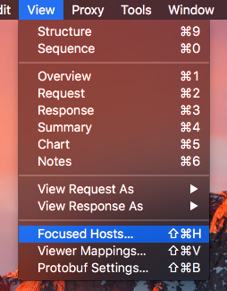
	 
	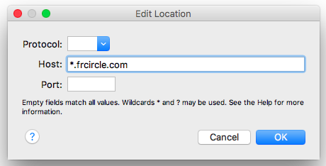
	 
	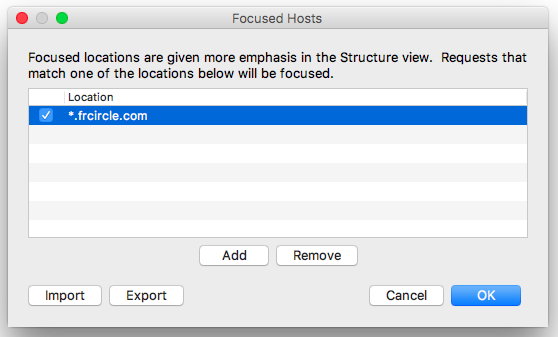

### Recording settings

Bước này dùng để lọc ra những thứ mà chúng ta sẽ record lại trong session.

- Vào **Settings** của session cần lọc, hoặc vào **Proxy > Recording Settings...**
- Chọn tab **Include**
- Thêm Locations. 

> **My note:** Thường thì mình chỉ thêm host vào đối với Record settings, còn path/query thì mình hay đặt trong Breakpoint setting. Còn protocol/port/query thì mình để trống, và chỉ quan tâm nó khi debug request. Mình sẽ nói rõ hơn ở phía dưới.

	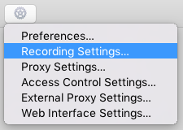
	hoặc
	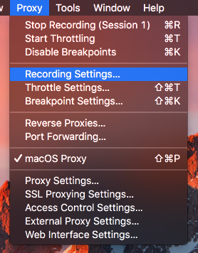
	 
	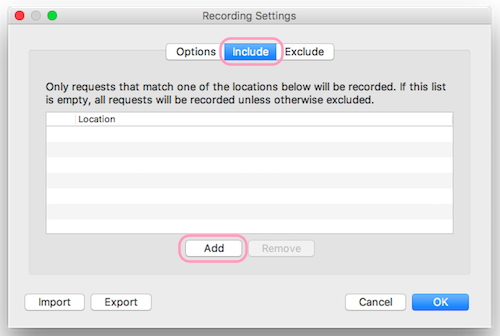
	 
	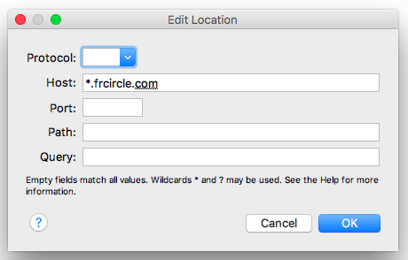
	 
	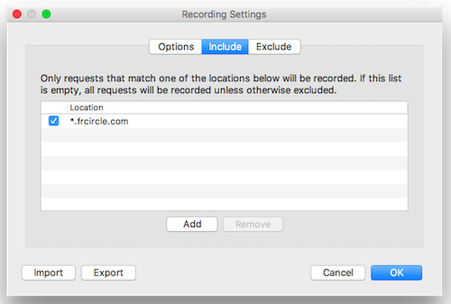
	 

> **My note:** Nếu như bạn không thấy trên Charles hiển thị request mà bạn đang debug, thì rất có thể bạn đã nhầm hoặc miss location ở bước này. Nhớ kiểm tra lại bạn đã add host bạn cần và check nó chưa nhé. 💣💣💣

Vậy là xong phần config cơ bản, tiếp theo đây chúng ta sẽ nói về cách debug cùng Breakpoint và Throttle settings. Trước khi debug với một web/ios/android app, bạn cần phải cài đặt môi trường và cài certificate đầy đủ. Đọc cài đặt môi trường debug cho iOS app tại [đây](./CharlesGuide-Install.md)

Check list:
 
- [x] Config Proxy
	- [x] Bật macOS Proxy cho Charles
	- [x] Config proxy cho device
- [x] Config Configuring SSL Proxying Certificates
	- [x] Thêm Charles CA Certificate cho máy mac
	- [x] Bật SSL Proxy cho máy mac và cài đặt SSL cho tất cả host name
	- [x] Bật trust SSL Certificate cho device/simulator

Phần đầu tiên, ta sẽ học cách đặt breakpoint.

### Breakpoint

- Vào **Proxy > Breakpoint Settings...**
- Thêm breakpoint:
	- Adding host: Vì mình đã cài đặt trong `Recording setting` ở phía trên rồi, nên ở bước này có thể bỏ qua. Nếu bạn điển phần này, thì nhớ phải check lại trong Recording Setting xem host bạn điền đã được add và check chưa.
  	- Adding path: `v1/item/search`
  	- Add query: `name=somename` Có thể để trống bước này
	- Check breakpoints: `request/response`
		- Nếu bạn tick `request`, thì khi app gọi tới url này, bạn có thể thay đổi thông tin của request như heading, parameter, method,...
		- Nếu bạn tick `response`, bạn có khả năng thay đổi các thông tin như cấu trúc response xml, code,...

	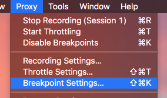
	 
	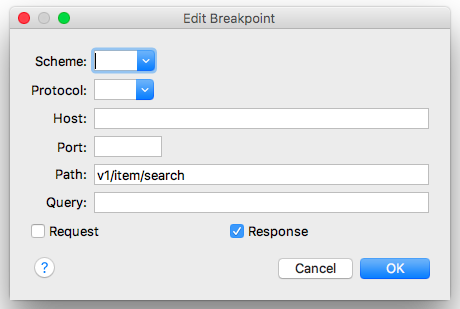
	 
	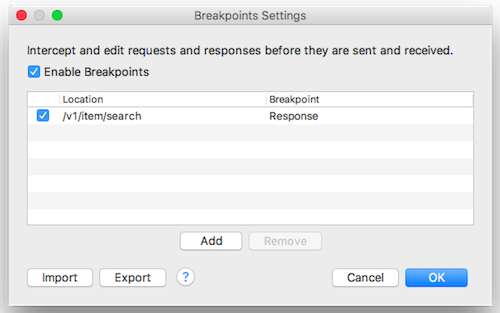

Trên đây là ví dụ breakpoint đặt ở `response` với path là `v1/item/search`. Vậy khi app gọi tới url này và server phản hồi, Charles sẽ bật cửa sổ breakpoint request lên. Cách handle breakpoint sẽ được đề cập ngay bên dưới.

### Handling breakpoint

Sau khi đã đặt được breakpoint thì bước này dễ như ăn kẹo.

	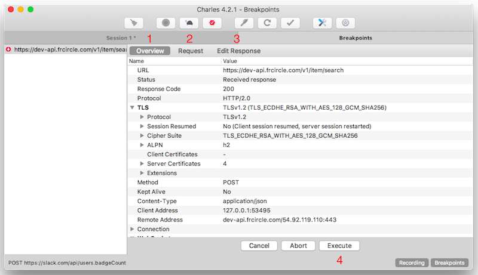

- Tab **Overview** để theo dõi thông tin cơ bản của request và response: url, protocol, response code, method, content type...
- Tab **Request** để xem thông tin chi tiết của request 
- Tab **Edit Response** để xem và sửa đổi thông tin chi tiết của response. Ví dụ như:
   - Header: Editing header
   - JSON text: Editing body
- Tab **Execute** để tiếp tục

### Throttle settings

Như mình đã đề cập, chức năng này được sử dụng để điều chỉnh băng thông chậm: download, upload...

- Vào **Proxy > Throttle Settings...**
- Config throttle setting

	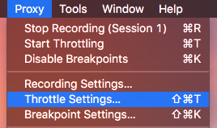
	 
	

Phía trên là những chức năng cơ bản và thường được sử dụng nhất của Charles. Hi vọng mọi người đã biết được một vài kiến thức hữu ích khi đọc tài liệu này. Ủng hộ mình một ⭐️ để có thêm động lực viết bài nhé! Cảm ơn mọi người. 🎉

### Reference

Đọc lại [Hướng dẫn cài đặt Charles](./CharlesGuide-Install.md) 🔧

Quay lại [Charles Guide](https://github.com/nmint8m/charlesguide) 