#  Charles Guide - Install

*Written by __Nguyen Minh Tam__*

> __Note:__
>> Reading [Charles Guide - Install][Charles Guide EN Version] with English version.
>> 
>> Reading [Charles Guide - Usage][Charles Guide EN Version] with English version.

Nếu bạn là một mobile developer, mình khá chắc là bạn đã từng gặp qua tình huống éo le `vỡ UI` ít nhất một lần trong đời. `Vỡ UI` thường được bắt gặp khi mà bạn có một cái text, nội dung của cái text này được lấy bằng cách truy xuất database, hoặc từ kết quả mà API trả về. Cơ mà bạn lại quên mất việc kiểm tra UI khi nội dung cái text này dài ra trên các màn hình khác nhau, dẫn tới hậu quả UI của bạn banh chè.

Mục đích của bài viết này giúp các bạn làm quen với một tool rất chy là bá đạo, cân từ debugging đến testing. 

Ví dụ nhé, nó giúp bạn có thể test các hiển thị lên UI của nhiều data set khác nhau như thế nào, ngay cả khi bạn chưa implement API. Trong một diễn biến khác, nó có thể giúp bạn debugging cách bạn call API đã đúng chưa: kiểm tra bạn đang gọi GET/POST/..., header ra sao, parameter như nào,... Ngoài ra nó còn cho phép bạn test những trường hợp download mạng chậm nữa.

Và cái tool thần thánh được nhắc đến trong bài viết này chính là `Charles - Web Debugging Proxy Application`.

> __Note:__ Các ví dụ mình đề cập trong bài viết này là những kinh nghiệm mình có được khi trong implement app trên iOS. Mình nghĩ về cơ bản thì develop Android và iOS khá giống nhau, nên chắc tài liệu này cũng có chút hữu ích với với các bạn Android developer.

## Mục lục
- [Install Charles](#install-charles)
- [Configure Charles và môi trường](#configure-charles-và-môi-trường)
	- [Config Proxy](#config-proxy)
 		- [Enable macOS Proxy for Charles](#enable-macos-proxy-for-charles)
 		- [Config proxy cho iOS Device](#config-proxy-cho-ios-device)
 		- [Config proxy cho iOS Simulator](#config-proxy-cho-ios-simulator)
	- [Configuring SSL Proxying Certificates](#configuring-ssl-proxying-certificates)
		- [Add Charles CA Certificate](#add-charles-ca-certificate)
		- [Enable SSL Proxying Setting](#enable-ssl-proxying-setting)
		- [Trusting Charles's SSL Certificates](#trusting-charles-s-ssl-certificates)

## Install Charles

Để cài đặt Charles cần:

- Truy cập vào đường link [https://www.charlesproxy.com][Download] và download file installer về máy.

	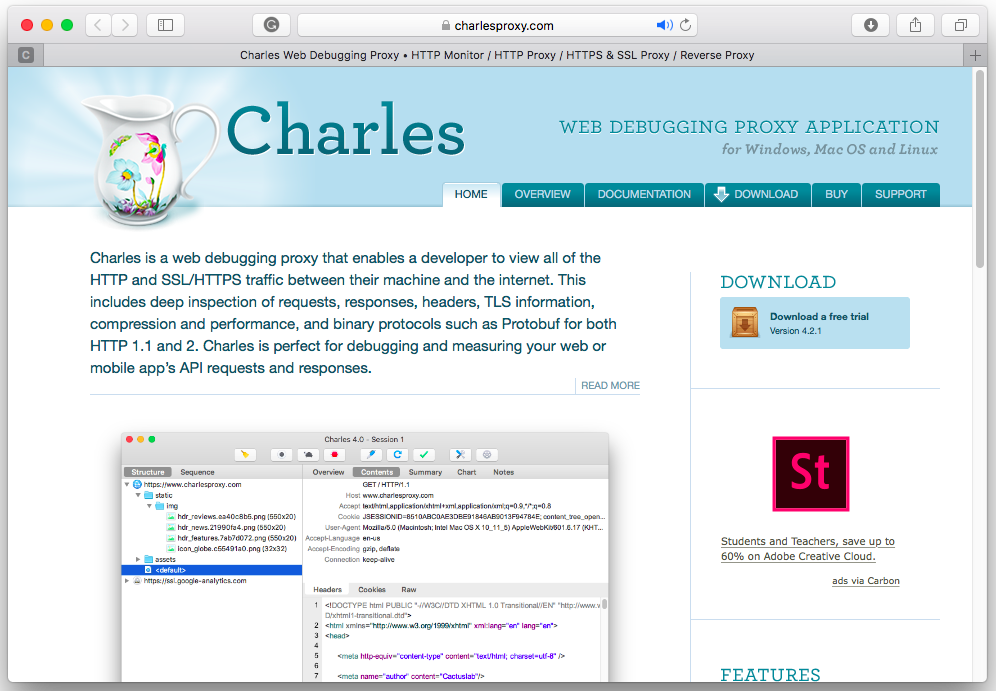

- Khởi động installer đã down về, hoàn thành theo chỉ dẫn:

	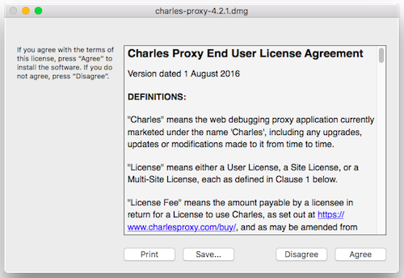
	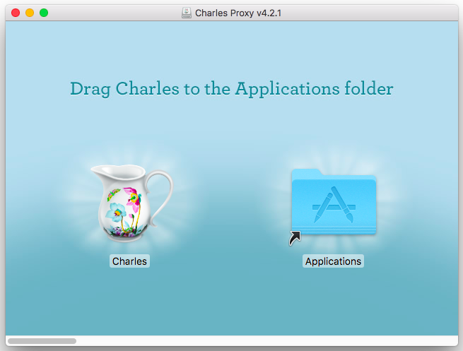

- Khởi động Charles:

	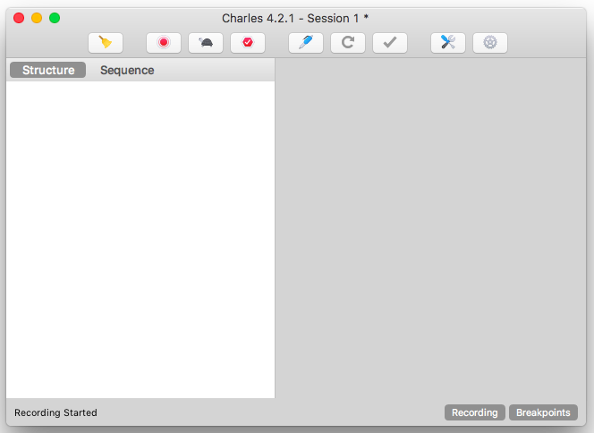

- Gói Charles free cho 30 ngày, vào đây để mua license nhé. Sau đó thì đi tới __Help > Register Charles... > Điền Register Name và License Key__ để đăng ký rồi restart lại Charles.

	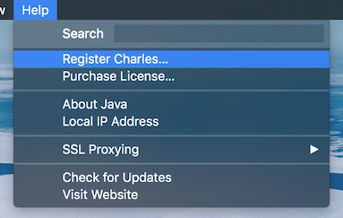
	 
	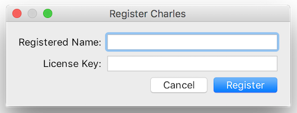
	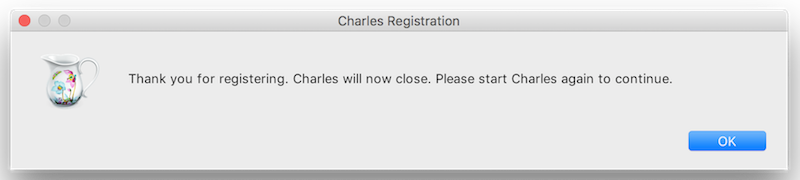

## Configure Charles And Environment

Phần set up Charles và môi trường là phần vô cùng quan trọng. Nếu bạn set up môi trường không đúng hoặc không đầy đủ, điều tất yếu là bạn sẽ chả thể làm việc được với nó.

Để giúp bạn có thể kiểm tra liệu mình đã set up đúng chưa, thì sau đây là checklist các bước mình sử dụng:

- [ ] Config Proxy
	- [ ] Bật macOS Proxy cho Charles
	- [ ] Config proxy cho device
- [ ] Config Configuring SSL Proxying Certificates
	- [ ] Thêm Charles CA Certificate cho máy mac
	- [ ] Bật SSL Proxy cho máy mac và cài đặt SSL host name
	- [ ] Bật trust SSL Certìicate cho device/simulator

### Config Proxy

Proxy là một Internet server làm nhiệm vụ chuyển tiếp thông tin và kiểm soát tạo sự an toàn cho việc truy cập Internet của các máy client. 

Khi sử dụng Charles trên máy Mac, bạn cần config cho Charles sử dụng macOS Proxy.

#### Enable macOS Proxy for Charles

Lần đầu sử dụng Charles bạn sẽ được tự động hỏi về việc cấp quyền macOS Proxy như sau. Chọn __Grant Privileges__ và nhập user name và password:

	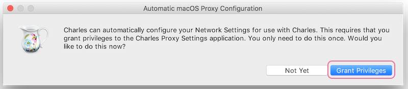
	 
	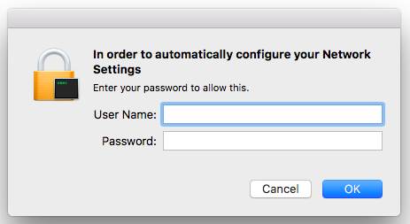

Sau khi enable macOS Proxy cho Charles, dấu tick sẽ xuất hiện bên cạnh mục __View > macOS Proxy__ như thế này:

	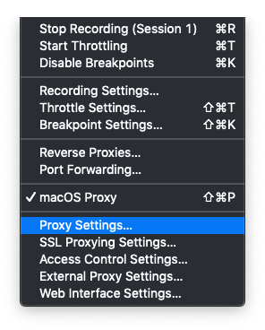

Nếu bước trên bạn chọn __Not yet__ trong lúc cài đặt __Automatic macOS Proxy Configuration__, lần tới bạn có thế cài đặt thông qua __View > Proxy Settings...__.

#### Config proxy cho iOS Device

Khi bạn chọn debug app của bạn trên real device cùng với Charles, bạn cần phải trỏ HTTP Proxy của device đến máy tính mà bạn đang sử dụng.

> __Lưu ý:__ Máy tính và điện thoại của bạn phải xài cùng wifi.

Config cho device như sau:

- Vào __Settings > Wifi__.
- Chọn network đang kết nối tới.
- Chọn __Config Proxy__.
- Chọn __Manual__ và điền vào form, trong đó:
	- Server: Địa chỉ IP của máy tính đang chạy Charles
	- Port: Cổng mà Charles chạy (thường là 8888)
	- Authentication: Off

	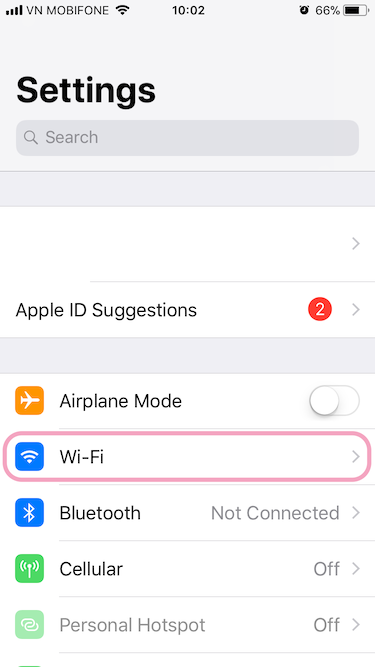
	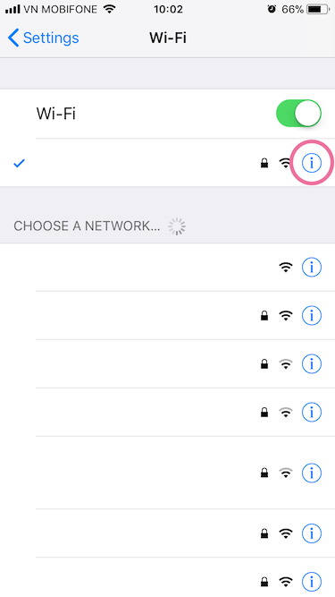
	 
	 
	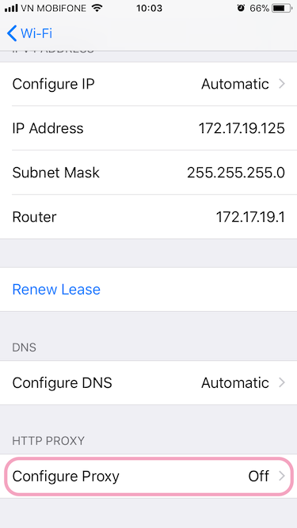
	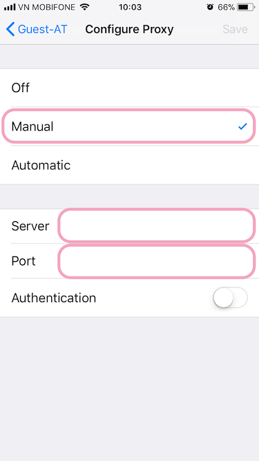

Để biết local IP của máy tính, vào __Help > Local IP Address__.

	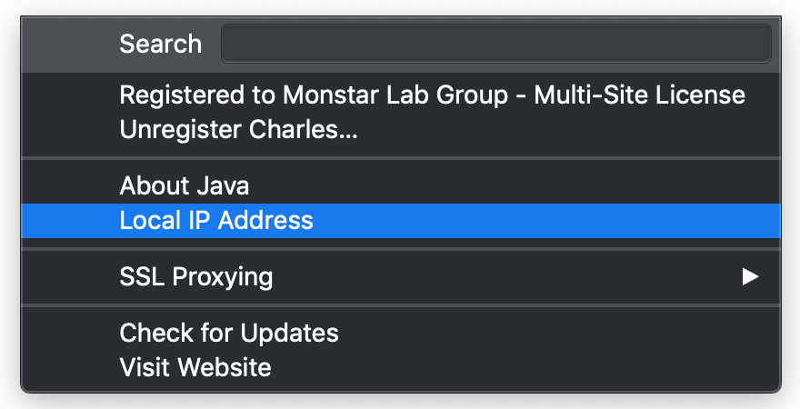
	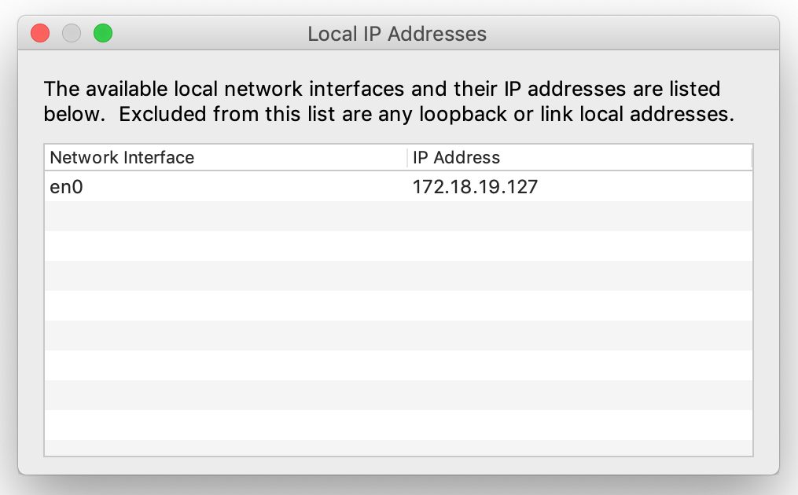

Tiếp tục, config access control cho máy mac như sau:

- Vào __Proxy > Access Control Settings…__ để cho phép các device được phép kết nối với Charles bằng cách thêm mới.

	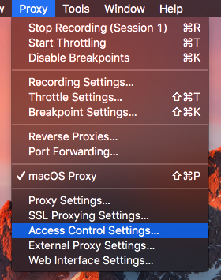
	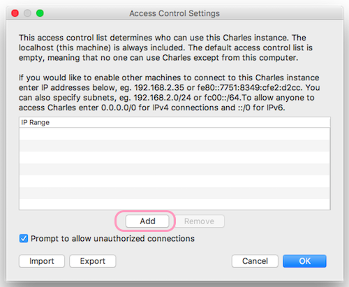

> __Lưu ý__:
> Sau khi testing và debug trên device xong, nhớ setting lại wifi của device, bằng cách vào __Setting > Wifi__, chọn wifi sử dụng, chọn __Config Proxy > Off__. Nếu không làm vậy thì điện thoại của bạn không xài wifi được đâu.

#### Config proxy cho iOS Simulator

Simulator đã sử dụng system proxy, nên không cần phải config proxy cho simulator nữa. Nếu simulator vẫn gặp trục trặc, hãy khởi động lại simulator.

### Configuring SSL Proxying Certificates

	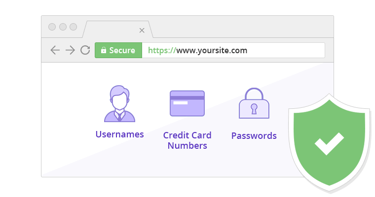

Charles có thể được sử dụng như một HTTPS proxy ở giữa, cho phép bạn đọc dữ liệu giao tiếp giữa web browser và SSL web server. Thay vì browser sẽ đọc certificate của server, Charles lúc này sẽ tạo một certificate cho server và xác thực bằng chính root certificate của nó (Charles CA Certificate). Charles nhận certificate của server trong khi browser của bạn nhận certificate của Charles. Vậy nên bạn sẽ nhận được thông báo bảo mật nói rằng `the root authority is not trusted`. Thông báo này sẽ không xuất hiện nữa nếu bạn đã thêm Charles CA Certificate vào trusted certificates.

#### Add Charles CA Certificate

- Vào __Help > SSL Proxying > Install Charles Root Certificates__.
- Thêm __Certificates__.
- Chọn __Charles Proxy CA__.
- Chọn __Always Trust__.
- Kết quả sẽ được như sau.

	
	 
	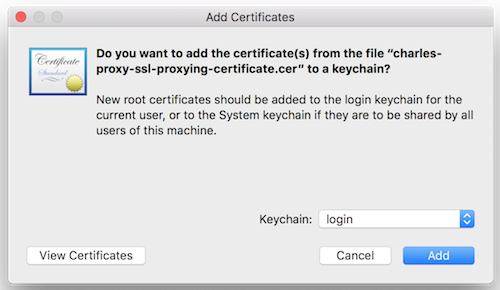
	 
	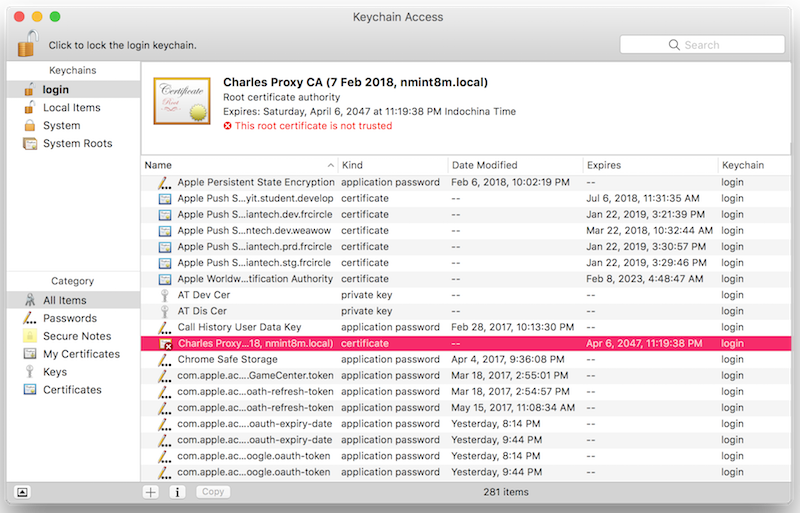
	 
	
	 
	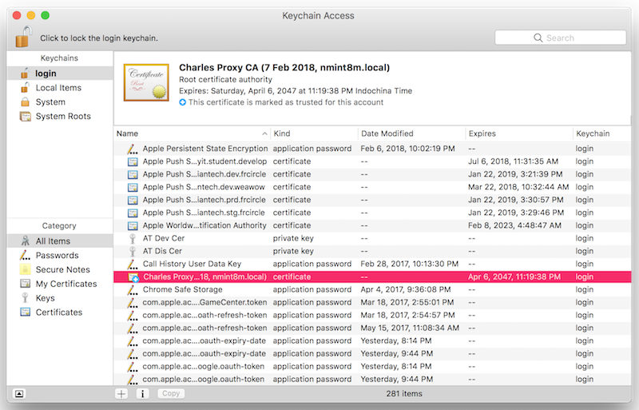

Tiếp theo, bạn cần xác định những host name mà bạn muốn bật SSL proxy. Với mình thì mình bật cho tất cả các host name.

#### Enable SSL Proxying Setting

- __Proxy > SSL Proxying Settings...__
- Ở tab __SSL Proxying__, chọn __Enable SSL Proxying__.
- Thêm __Location__.
- Khởi động lại browser đang sử dụng (Safari/Chrome/...) để áp dụng thay đổi.

	
	 
	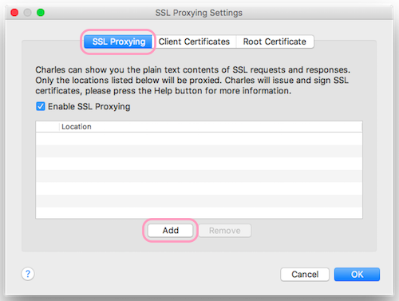
	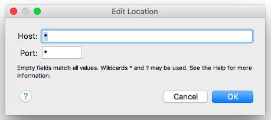

#### Trusting Charles's SSL Certificates

Vì kể từ lúc này Charles sẽ tự tạo certificate của chính nó, được xác thực bằng Charles Root Certificate, nên khi bạn test hoặc debug trên device/simulator, bạn sẽ nhận được cảnh báo Charles Root Certificate không thuộc trong list trusted root certificate của device/simulator. Đó là lý do ta cài đặt Charles’s Root Certificate và bật Certificate Trust.

__Đối với iOS Device__

- Thực hiện cài đặt iOS device sử dụng Charles proxy như trong mục [Config proxy cho iOS Device](#config-proxy-cho-iOS-Device)
- Mở Safari và truy cập tới [https://chls.pro/ssl](https://chls.pro/ssl) và chọn `Install` SSL certificate.
- Tiếp tục vào __Settings > General > About > Certificate Trust Settings__.
- Dưới mục __Enable full trust for root certificates__, bật cetificate cho Charles Proxy.

	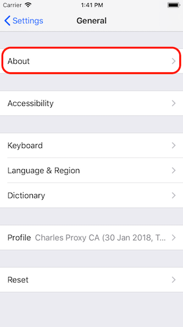
	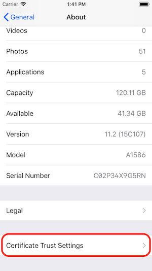
	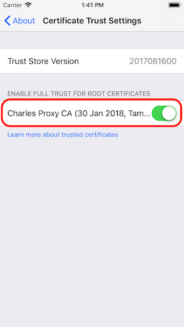

__Đối với iOS Simulator__

- Cài cho tất cả các simulator:
	- Tắt tất cả simulator
	- Trên Charles, vào __Help > SSL Proxying > Install Charles Root Certificate in iOS Simulators__.

	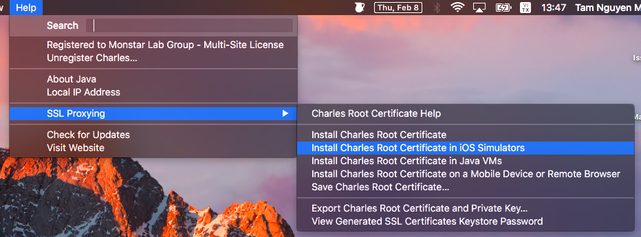

- Cách trên đôi khi không thành công. Ta có thể thực hiện cài cho simulator bạn cần dùng như sau:
	- Vào __Help > SSL Proxying > Save Charles Root Certificate…__ để lưu file *.pem ra Desktop.
	- Kéo thả file *.pem vừa tạo vào simulator.

	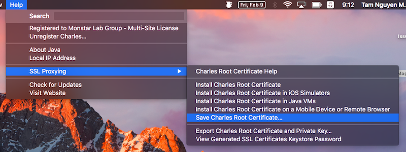
	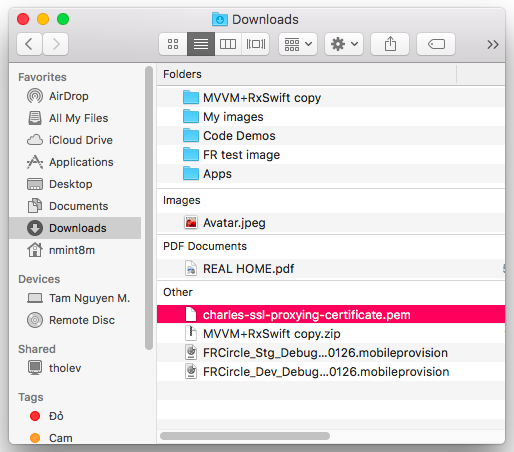

	

	- Thực hiện cài đặt certificate cho simulator.

	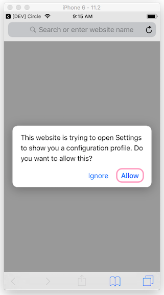
	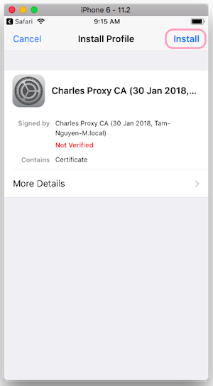
	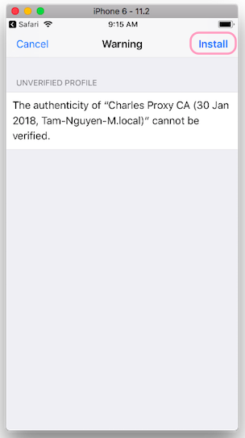
	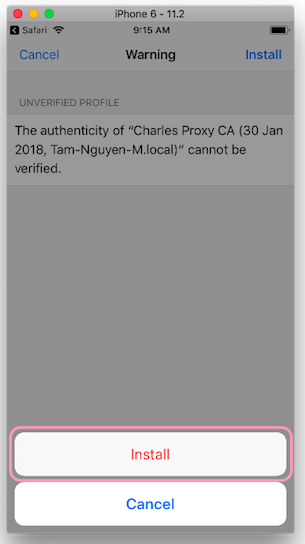
	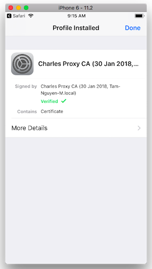

	

- Bật trust certificate cho simulator bằng cách:
	- Vào __Settings > General > About > Certificate Trust Settings__.
	- Dưới mục __Enable full trust for root certificates__, bật cetificate cho Charles Proxy.

	
	
	

### Reference

Đọc tiếp [Charles Guide - Usage][Charles Guide - Usage].

Reading [Charles Guide - Install][Charles Guide EN Version] with English version.

Reading [Charles Guide - Usage][Charles Guide EN Version] with English version.

---

[Charles Guide - Usage]: ./README-VN-Usage.md "Charles Guide - Usage VI Version"

[Charles Guide EN Version]: ./README.md "Charles Guide EN Version"

[Download]: https://www.charlesproxy.com/download/